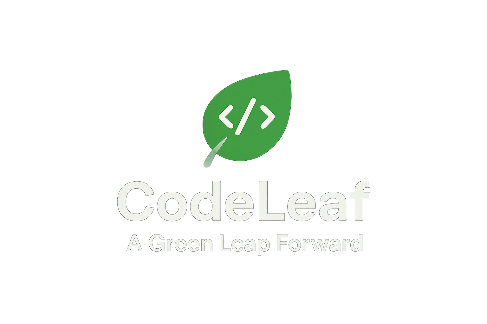

<p align="center">
  
</p>

<p align="center"><i>"🌿 A Green Leap Forward — Smarter, Greener Code"</i></p>

---

## 📌 About

**CodeLeaf AI** is an **AI-powered platform** that measures and optimizes the **carbon footprint of software**.  
It empowers developers and enterprises to write **energy-efficient code**, track emissions, and align coding activities with **Environmental, Social, and Governance (ESG) goals**.  

Built for students, professionals, and teams, CodeLeaf AI provides **actionable insights, AI-driven code optimization, and ESG-compliant reporting** to foster sustainable software development.

---

## ✨ Key Functionalities

### Phase 1 — Core ESG Features (MVP)
- Multi-language carbon estimation (Python, C, C++, Java, JavaScript, SQL).  
- Automatic detection of programming language.  
- Code optimization suggestions to reduce CO₂ footprint.  
- Real-time dashboard with:
  - Estimated CO₂ (kg)  
  - Energy consumption (kWh)  
  - Environmental equivalents (e.g., powering a 10W LED)  
  - Session-level emission trends.  
---

### Phase 2 — ESG Insight Layer
- Auto-generated ESG reports (PDF/HTML) for each coding session.  
- Eco-efficiency scoring combining code performance and emissions.  
- ESG Compliance Badges (Bronze, Silver, Gold based on emission reduction).  
- Developer profiles with gamification and leaderboards.  
- Emission budgeting & alerts for sustainable coding thresholds.  

---

### Phase 3 — Enterprise & Data Science Integration
- ESG Data Integration APIs for SASB, GRI, TCFD frameworks.  
- Smart recommendation engine: ML-powered code optimization suggestions.  
- Green infrastructure awareness:
  - Compare emissions across cloud regions, hardware setups, and runtime environments.  
  - Suggest carbon-optimal deployment options.  

---

### Phase 4 — ESG Governance & Trust Layer
- Carbon Credit Ledger (Blockchain integration) to record emission reduction events.  
- Issue verifiable GreenNFTs for ESG audits.  
- ESG Risk & Compliance Engine to flag emission-heavy code.  
- Responsible AI Dashboard tracking AI model energy consumption.  
- Community ESG Repository for sharing optimized green code.  
- Gamified leaderboard to promote sustainable coding contributions.  

---

## 🚀 ESG-Centric Development Roadmap

| Phase | Duration | Key Deliverables | ESG Impact |
|-------|---------|----------------|-----------|
| 1 – Core ESG Features | 1–2 months | Multi-language carbon estimation, code optimization suggestions, real-time dashboard | Direct measurement and optimization of emissions |
| 2 – ESG Insight Layer | 2–3 months | ESG report generation, eco-efficiency scores, developer profiles | Actionable insights & awareness |
| 3 – Enterprise Integration | 2–4 months | Enterprise APIs, smart recommendations, green deployment suggestions | Corporate ESG integration |
| 4 – ESG Governance & Trust | 3–6 months | Blockchain ledger, ESG risk engine, responsible AI dashboard, community repo | Governance, transparency, sustainable ecosystem |

**ESG Pillar Alignment**  

- **Environmental:** Carbon estimation, optimization, green deployment  
- **Social:** Developer profiles, gamification, community ESG repository  
- **Governance:** Blockchain-based audit, ESG risk engine, responsible AI monitoring  

**Investor Pitch Highlights**  

- **Innovation:** First AI-driven code emission tracker for developers.  
- **Sustainability:** Quantifies developer carbon footprint in real-time.  
- **ESG Integration:** Aligns with corporate ESG frameworks (SASB, GRI, TCFD).  
- **Scalability:** Multi-language, multi-cloud, enterprise-ready.  
- **Gamification & Awareness:** Encourages sustainable coding habits globally.  

---

## 🛠️ Tech Stack

- **Frontend:** Streamlit (UI & Dashboard)  
- **Backend:** Flask (Python API)  
- **AI Models:** Hugging Face Inference API (Qwen, CodeT5, StarCoder)  
- **Carbon Tracking:** CodeCarbon  
- **Visualization:** Plotly + Pandas  
- **Version Control:** Git + GitHub  

---

## ⚡ Quick Start

1️⃣ **Clone the Repository**
```bash
git clone https://github.com/<your-username>/codeleaf-ai.git
cd codeleaf-ai
```
2️⃣ Create Virtual Environment

```bash
Copy code
python -m venv venv
# Linux/Mac
source venv/bin/activate
# Windows
venv\Scripts\activate
```
3️⃣ Install Dependencies

```bash
Copy code
pip install -r requirements.txt
```
4️⃣ Add Hugging Face Token

```bash
Copy code
HF_TOKEN=hf_xxxxxxxxxxxxxxxxx
```
5️⃣ Run Backend

```bash
Copy code
cd backend
python app.py
```
6️⃣ Run Frontend

```bash
Copy code
cd frontend
streamlit run app.py
```
<p align="center">Made with ❤️ by Leaf Core Labs</p> ```